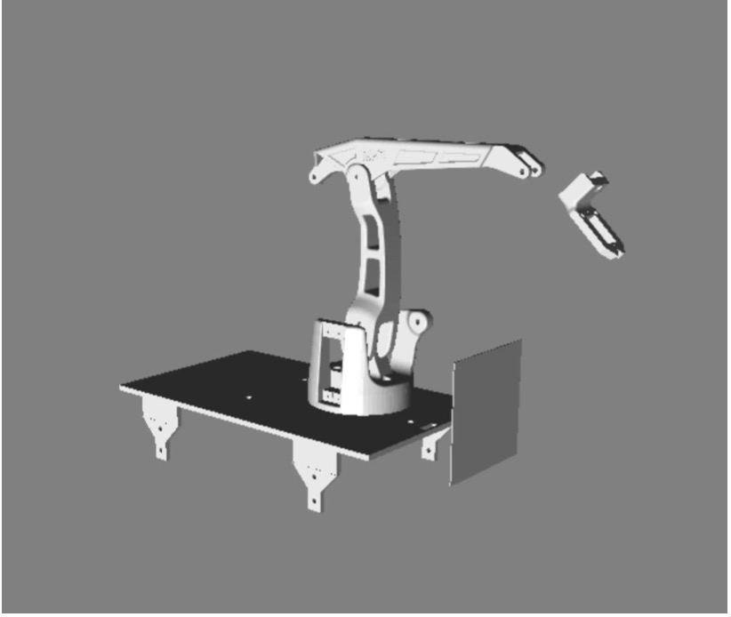

## Manipulator 

Manipulator on the movable platform that is based on Arduino. Controlled by hand gestures with a help of a 3-axis gyroscope and 3-axis accelerometer. Have a 3D digital twin also shows the  distance to the object in front of the robot.
The platform, manipulator and glove are connected to the control computer by Java. 

Components:
- Manipulator:
  1. Arduino UNO
  2. MPU-6050(3-axis gyroscope, 3-axis accelerometer)
  3. Bluetooth Module HC-06
  4. 3 + 2 Servo 
  5. Ultrasonic Sensor SR04
- Platform:
  1. Arduino Nano 
  2. Bluetooth Module HC-06
  3. 2 Drivers
  4. 4 Motors 
- Glove:
  1. Arduino Nano
  2. MPU-6050(3-axis gyroscope, 3-axis accelerometer)
  3. Bluetooth Module HC-06

Resources:

 - http://www.eezyrobots.it/eba_mk2.html - 3D model for manipulator
 - http://www.geekmomprojects.com/gyroscopes-and-accelerometers-on-a-chip/ - sources for working with MPU-6050
 - https://dspace.spbu.ru/bitstream/11701/26423/1/VKR_Polakov.pdf - solution of the direct and inverse problem of kinematics
